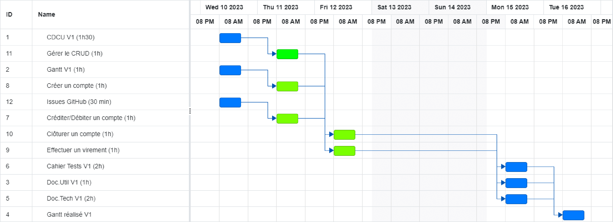

= SAE 02.01 - Développement d'une application

== Présentation de l'équipe et rôles respectifs

L'équipe est constituée de trois personnes::
  - Julie BAELEN (chef d'équipe)
  - Guilherme SAMPAIO (chargé de faire respect les délais)
  - Bastien RECORD (oraganisateur du dépôt Git)

== Répartition des tâches et états d'avancement
[%header,cols=7*]
|===
|Version  |Rôle           |Use Case           |Cas                    |BAELEN Julie       |SAMPAIO Guilherme  |RECORD Bastien
|1        |Chef d’Agence  |CRUD employé       |C                      |                   | | 
|1        |Chef d’Agence  |CRUD employé       |R                      |              | | 
|1        |Chef d’Agence  |CRUD employé       |U                      | | | 
|1        |Chef d’Agence  |CRUD employé       |D                      | | |
|1        |Guichetier     | Compte            |Créer                  || |
|1        |Guichetier     | Compte            |Créditer/Débiter       || |  
|1        |Guichetier     | Compte            | Effectuer un virement || |  
|1        |Guichetier     | Compte            | Clôturer              || |  
|2        |Chef d’Agence  | Compte            | Débit exceptionnel    || | 
|2        |Chef d’Agence  | Emprunt           | Simuler emprunt       || | 
|2        |Chef d’Agence  | Emprunt           | Simuler assurance     || | 
|2        |Guichetier     | Compte            | Relevé PDF            || | 
|2        |Guichetier     | CRUD Prélèvement  | C                     || |
|2        |Guichetier     | CRUD Prélèvement  | R                     || | 
|2        |Guichetier     | CRUD Prélèvement  | U                     || | 
|2        |Guichetier     | CRUD Prélèvement  | D                     || | 
|2        |Batch          | Prélèvements automatiques|                | || 
|2        |Batch          | Reléves mensuels  |                       | ||
|===

*D* pour en Développment +
*F* pour Fonctionnel

== Livrables
[%header,cols=4*]
|===
|Date       |Nom                |Lien                                                                                                   |Retour
| Sem.19    |CDC V1             |https://github.com/IUT-Blagnac/sae2023-bank-1b01/blob/main/VERSION%201/CDCU%20V1.adoc[CDCU Version 1]  |
|           |Gantt V1 Prévu     |https://github.com/IUT-Blagnac/sae2023-bank-1b01/blob/main/VERSION%201/Gantt%20V1.pdf[Gantt Prévu V1]  |
| 16/05     |CDC V2             |                   |
|           |Gantt V1 Réalisé   |                   |
|           |Gantt V2 Prévu     |                   |     
|           |Doc Tec V1         |                   |    
|           |Doc User V1        |                   |
|           |Recette V1         |                   | 
|           |`jar` V1           |                   | 
| 26/05     |Gantt V2 Réalisé   |                   | 
|           |Doc. Util. V2      |                   |         
|           |Doc. Tec. V2       |                   |     
|           |Chiffrage projet   |                   | 
|           |Recette V2         |                   | 
|           |`jar` V2           |                   | 
|===

== Planning Gantt V1

