= Documentation utilisateur Version 1
:toc:
:toc-title: Sommaire

Créé par : Équipe 1B1

== I. Présentation de l'application
[.text-justify]
L'application DailyBank permet la gestion de vos comptes en banque. De votre maison, à votre travail, l'application rend vos comptes disponibles partout. Que vous soyez employés, client, guichetier ou chef d'agence, vous pouvez utiliser DailyBank.

== II. Installation utilisation, fonctionnement

== 1) Page d'accueil
Voici la page d'accueil. Pour commencer à utiliser DailyBank, appuyez sur "Connexion"

image:Image Doc Util/1.jpg[]

== 2) Connexion
Une fois le bouton appuyé, voici le l'interface qui va apparaitre. Il suffit de rentrer vos informations tels que le Login et le mot de passe. Puis cliquez sur valider.

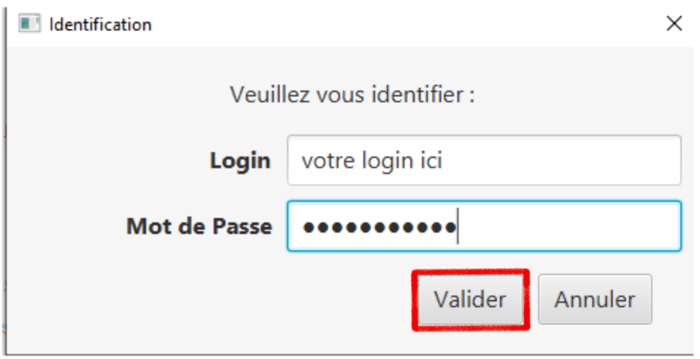

== 3) Utilisateur
Bienvenue sur votre compte DailyBank!
Vous pouvez désormais cliquer sur la section "Utilisateur".

image:Image Doc Util/3.jpg[]

Ce bouton permet de se connecter ou de se deconnecter.

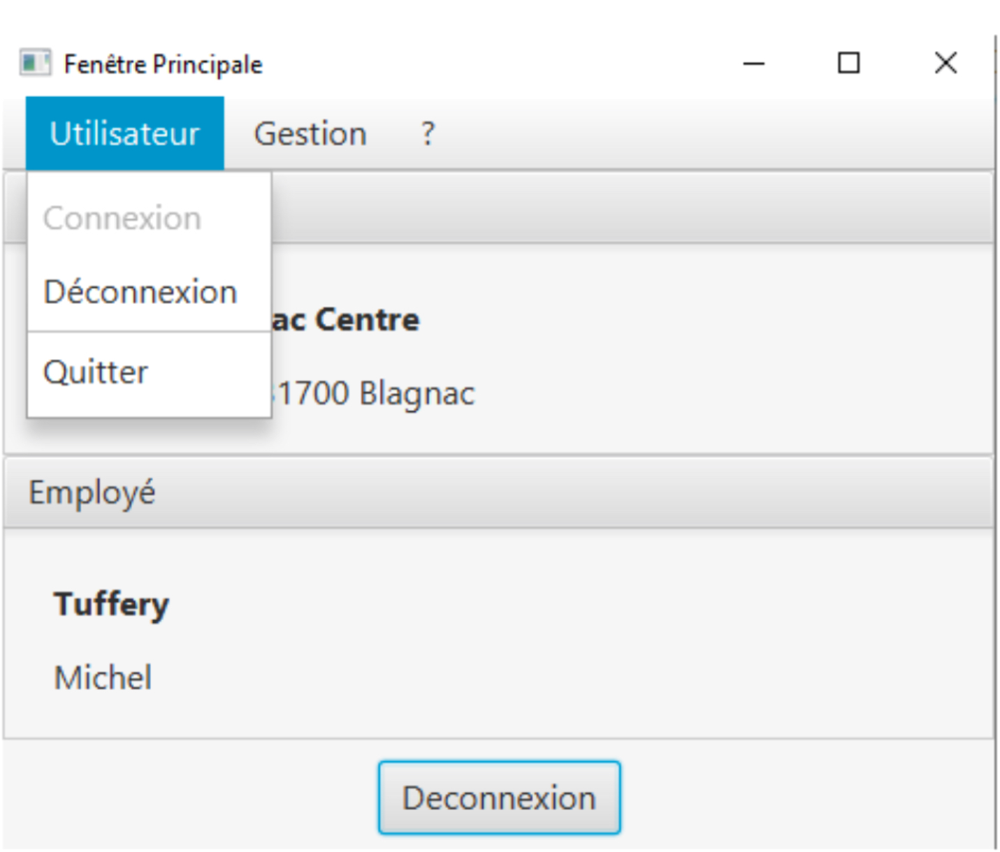

== 4) Gestion
Vous pouvez également appuyer sur le bouton "Gestion".

image:Image Doc Util/5.jpg[]

Ce bouton permet de voir les comptes des employés ou des clients.

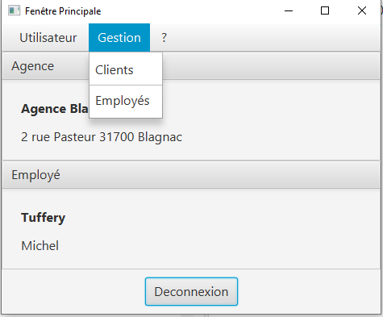

== 5) Bouton "?"
Vous pouvez aussi selectionner le bouton "?".

image:Image Doc Util/6.jpg[]

Celui ci permet d'obtenir une aide.

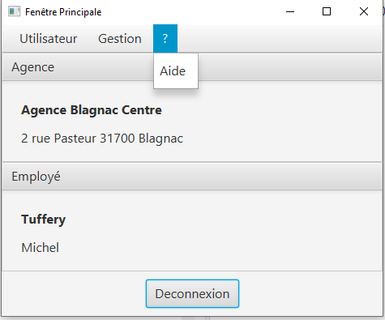

== 6) Gestion des comptes
Cliquons sur Gestion pour acceder aux comptes!

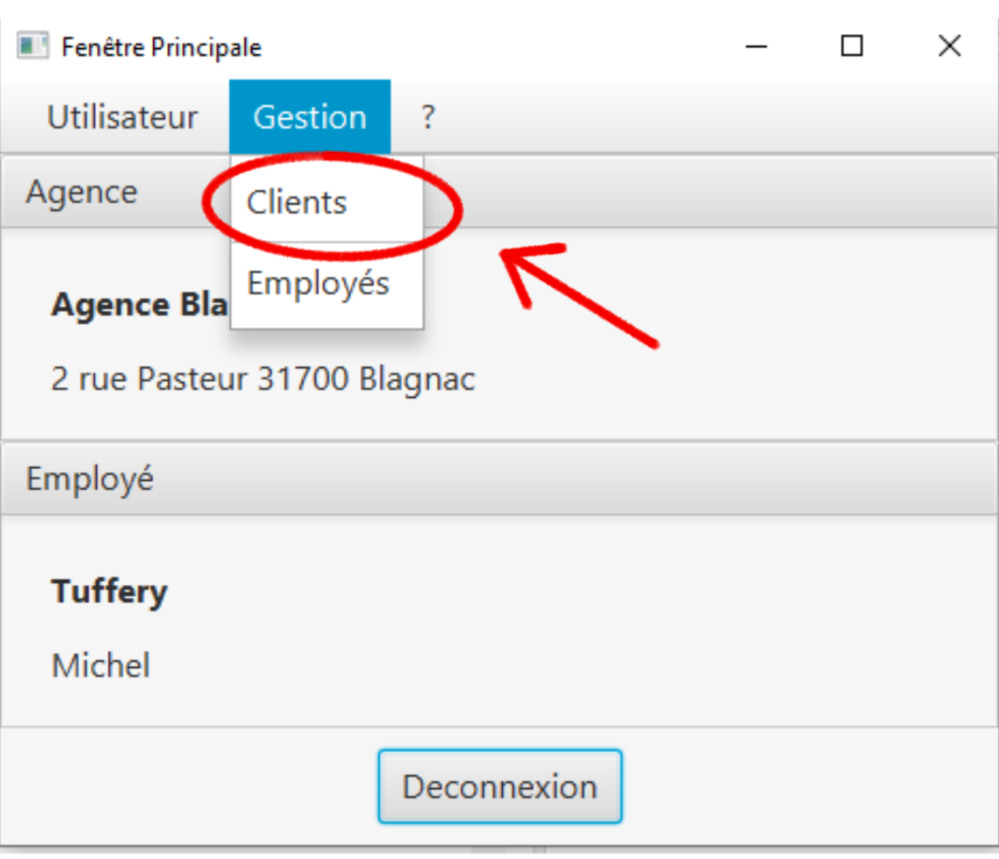

== 7) Rechercher
Nous arrivons sur une autre page, celle ci est l'accueil de gestion de comptes. Cliquons sur rechercher.

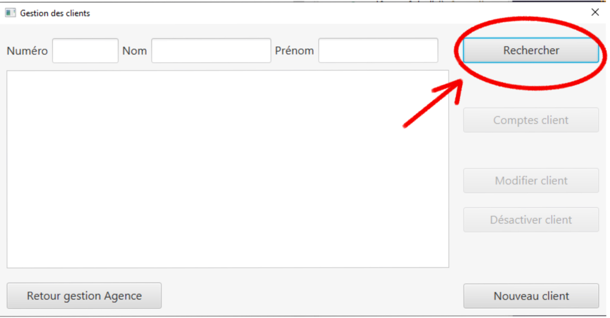

== 8) Comptes d'un utilisateur
Tous les utilisateurs apparaissent, choisissons un compte aléatoirement.

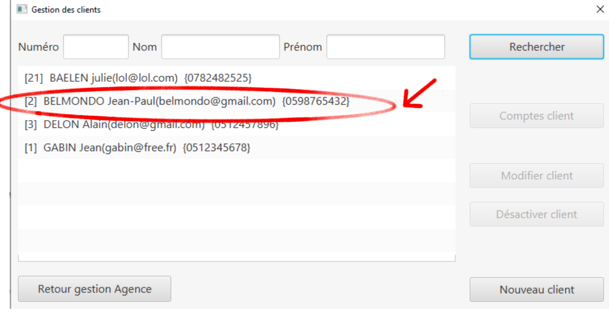

Cliquons sur "Comptes client"

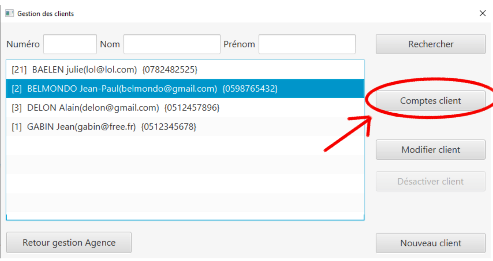

== 9) Opération

Voici les comptes de l'utilisateur que nous avons selectionné. Choisissons un compte aléatoirement, nous pouvons voir ses opérations en cliquant sur le bouton "opération".

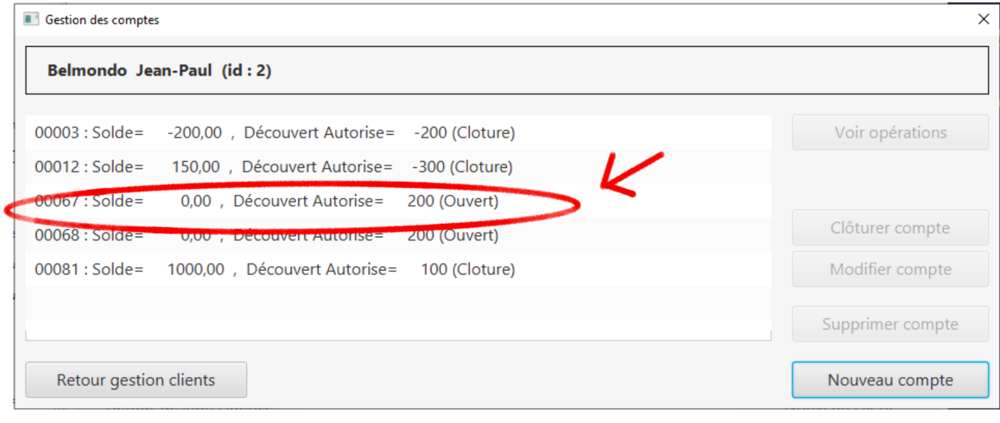

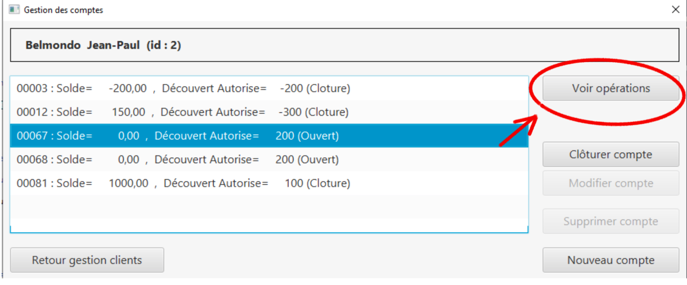

== 10) Débit/ crédit
Nous pouvons maintenant faire un crédit ou un débit, essayons avec un débit.

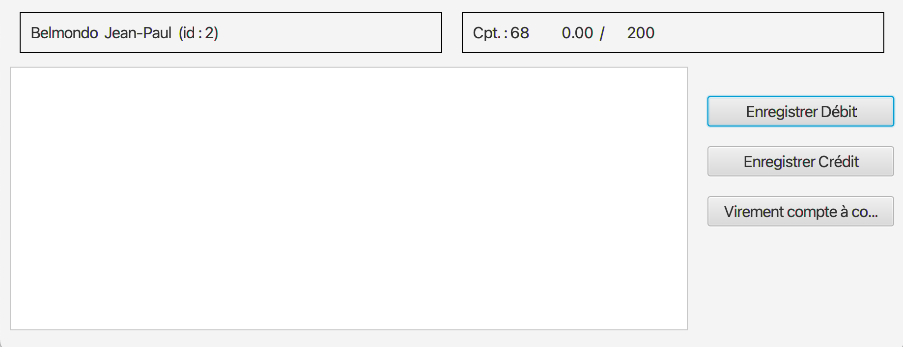

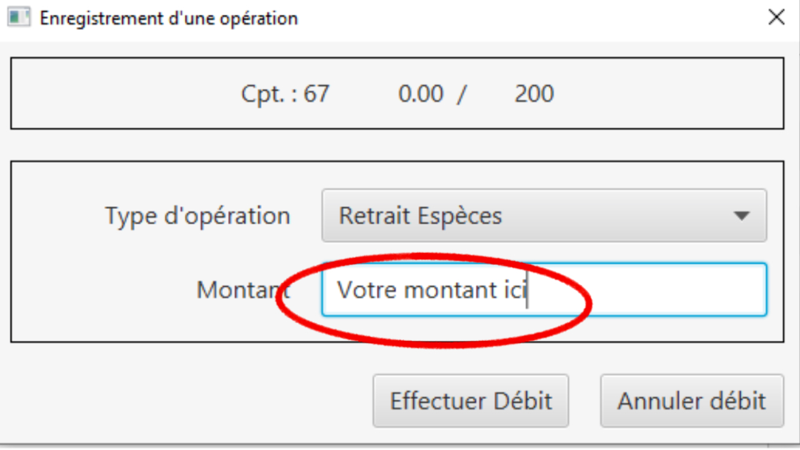

== 11) Clôturer un compte
En cliquant sur le bouton "clôturer un compte", un pop-up apparaitra pour s'assurer de votre décision de clôturer le compte.

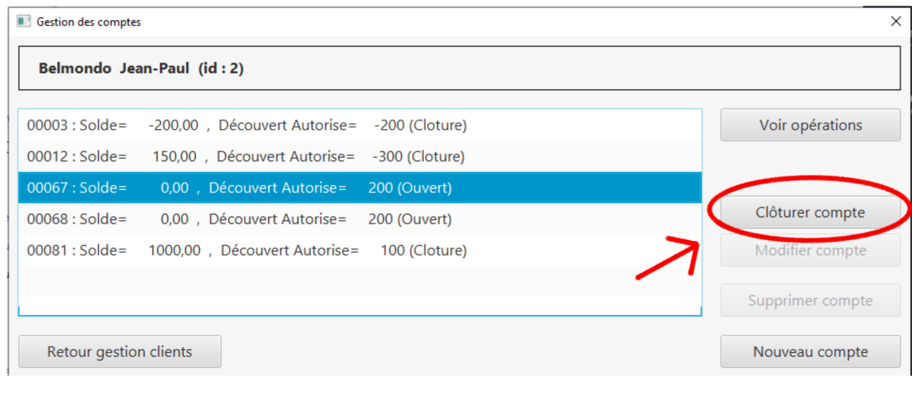

image:Image Doc Util/cloturer.PNG[]

== 12) Nouveau Compte utilisateur
Voici comment ouvrir un nouveau compte à un utilisateur.

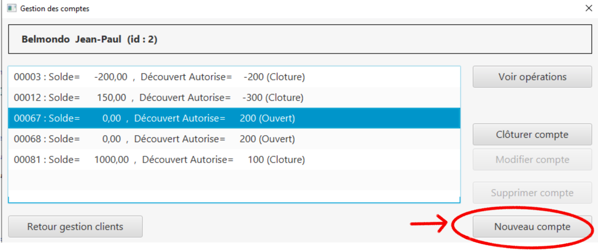

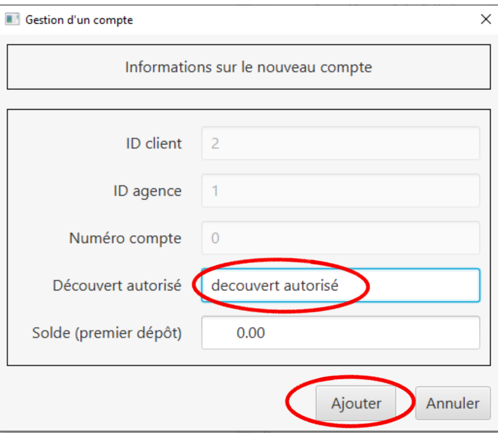

== 13) Modifier un client
Pour finir, vous avez la possibilité de modifier un client dans la partie gestion client.

image:Image Doc Util/17.jpg[]

image:Image Doc Util/18.jpg[]
