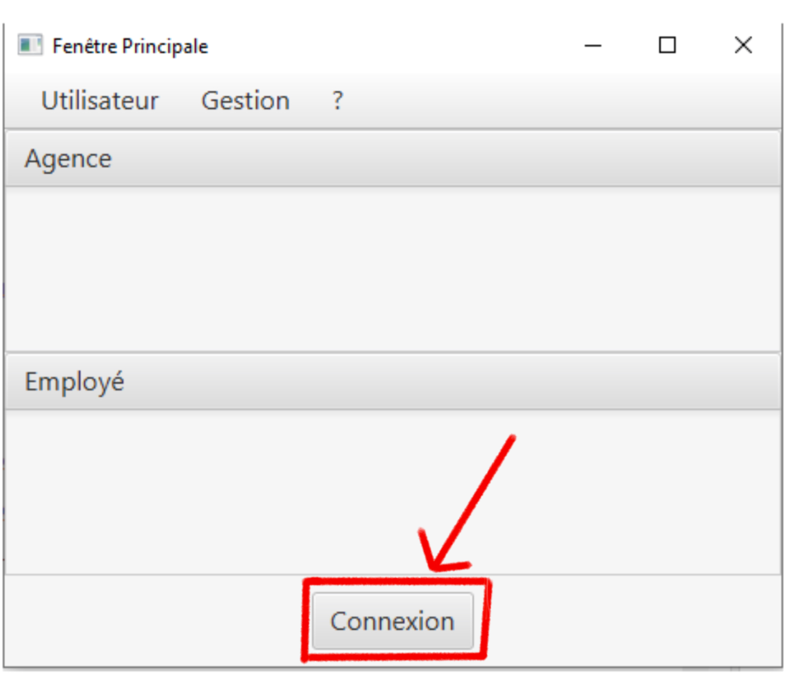
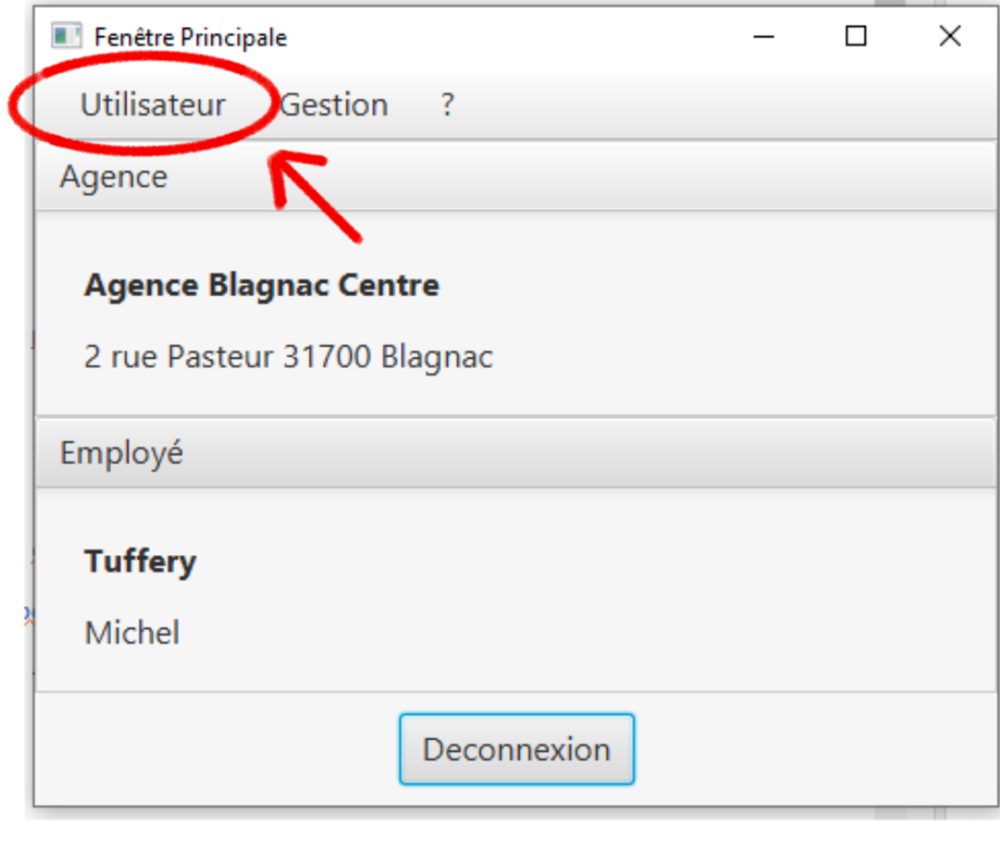
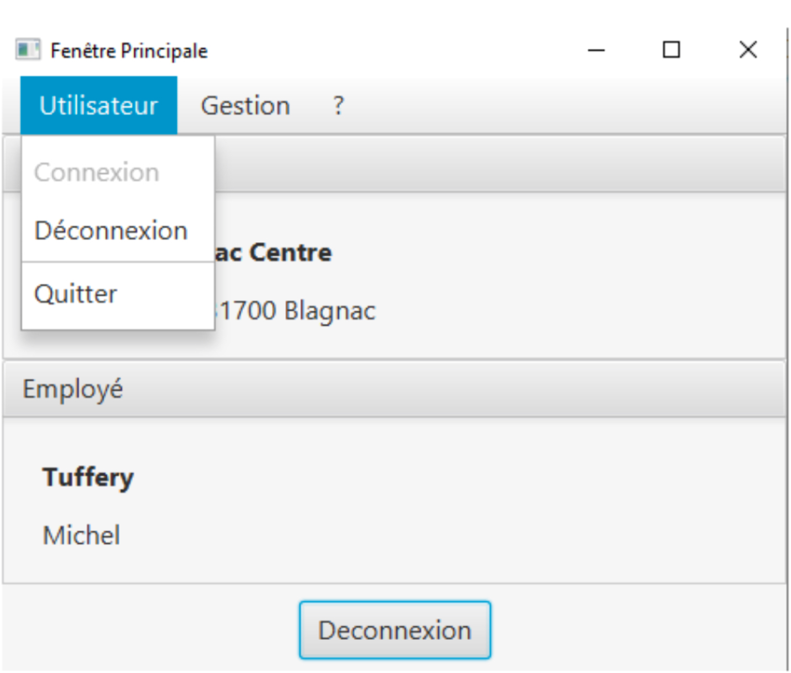
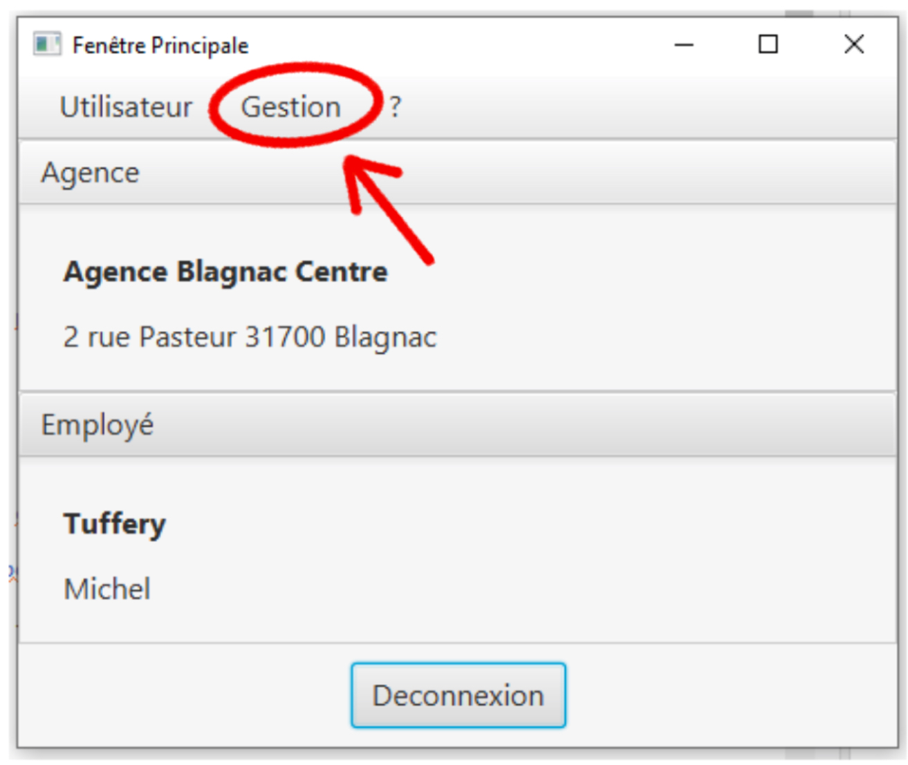
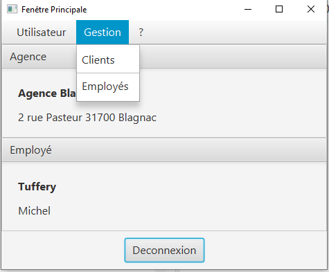
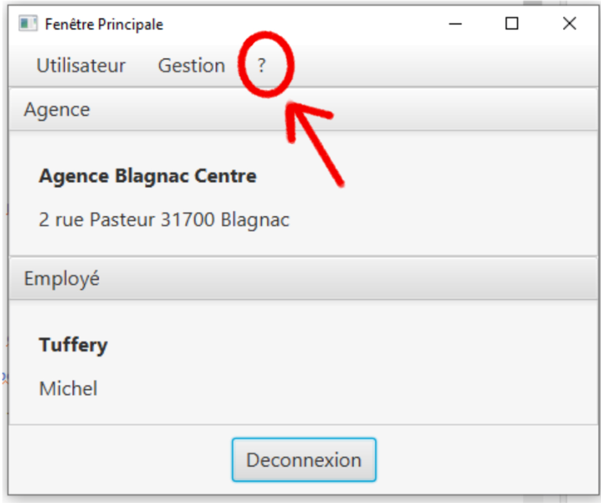
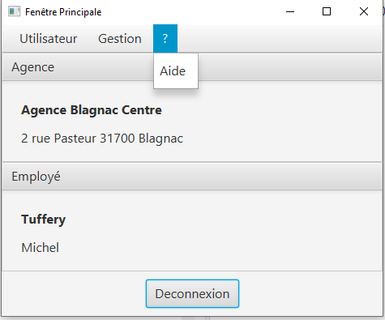
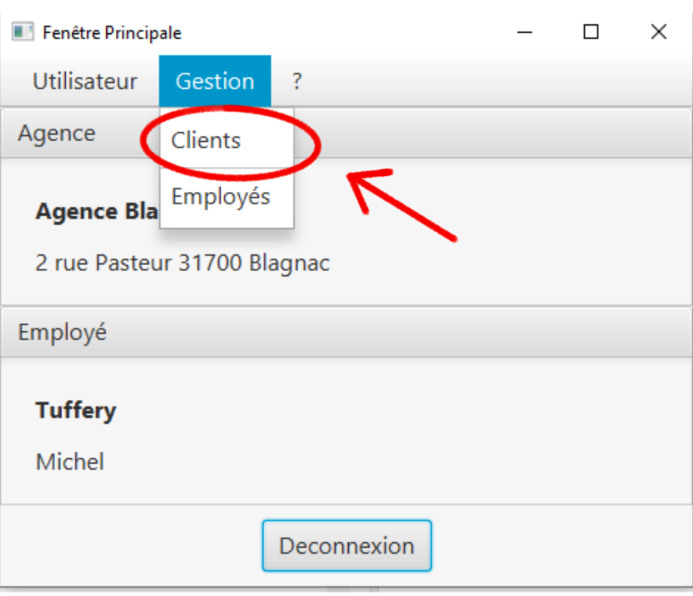
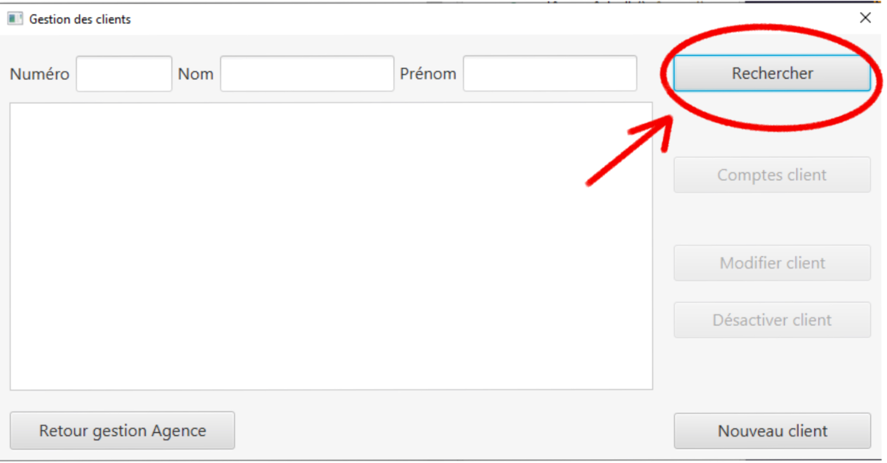
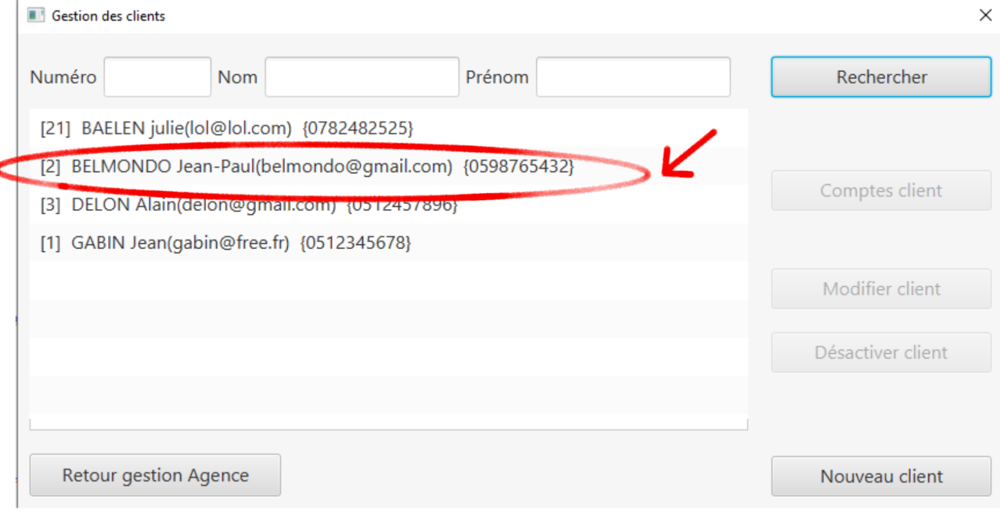

= Documentation utilisateur Version 1
:toc:
:toc-title: Sommaire

Créé par : Équipe 1B1

== I. Présentation de l'application
[.text-justify]
L'application DailyBank permet la gestion de vos comptes en banque. De votre maison, à votre travail, l'application rend vos comptes disponibles partout. Que vous soyez employés, client, guichetier ou chef d'agence, vous pouvez utiliser DailyBank.

== II. Installation utilisation

== 1) Page d'accueil
Voici la page d'accueil. Pour commencer à utiliser DailyBank, appuyez sur "Connexion"

== 2) Connexion
Une fois le boutton appuyé, voici le l'interface qui va apparaitre. Il suffit de rentrer vos informations tels que le Login et le mot de passe. Puis cliquez sur valider.

image:2.jpg[]

== Bienvenue sur votre compte DailyBank!

== Vous pouvez désormais cliquer sur la section "Utilisateur".

== Ce bouton permet de se connecter ou de se deconnecter.

== Vous pouvez également appuyer sur le boutton "Gestion".

== Ce bouton permet de voir les comptes des employés ou des clients.

== Vous pouvez aussi selectionner le boutton "?".

== Celui ci permet d'obtenir une aide.

== Cliquons sur Gestion pour acceder aux comptes!

== Nous arrivons sur une autre page, celle ci est l'accueil de gestion de comptes. Cliquons sur rechercher.

== Tous les utilisateurs apparaissent, choisissons un compte aléatoirement.

== III. Fonctionnement

