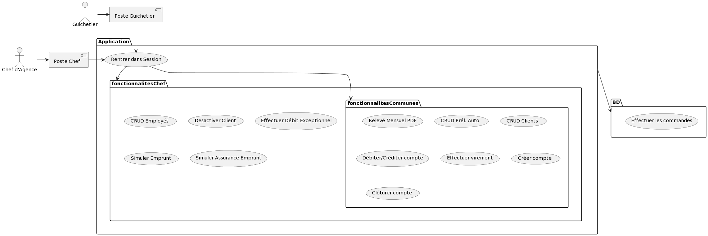
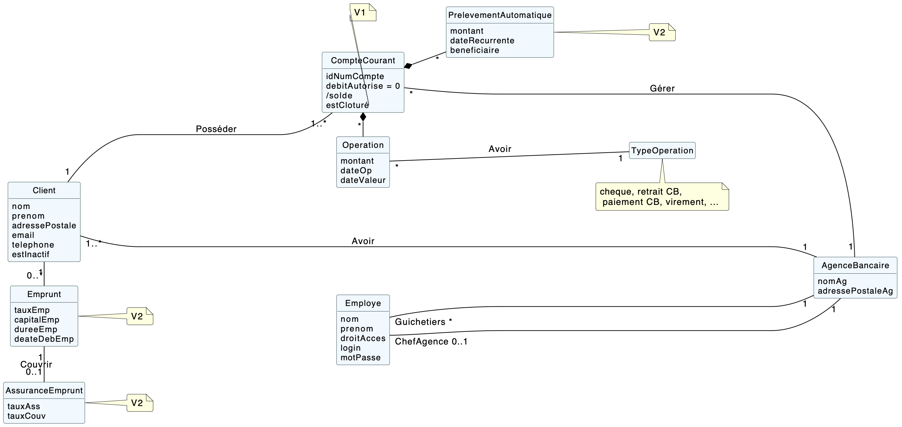
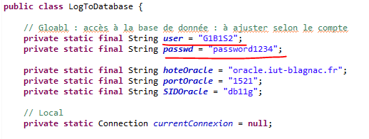

= Documentation technique Version 2
:toc:
:toc-title: Sommaire

Créé par : Équipe 1B1

== I. Présentation de l'application

=== 1. Organisation

Julie BAELEN -> Créditer / Débiter +
Guilherme SAMPAIO -> Créer un compte +
Bastien RECORD -> Clôturer un compte et Virement de compte à compte

=== 2. Description d'application
[.text-justify]
La banque DailyBank souhaite développer une application JAVA-Oracle de gestion des comptes clients pour remplacer plusieurs outils obsolètes. Ce développement s’inscrit dans le cadre de la restructuration de ses services bancaires et l’application sera déployée dans les 100 agences que compte son réseau. L’objectif est d’ajouter des fonctionnalités à cette première version de l’application.

Explication des différents rôles::
  * Le chef d'agence +
  ** le chef d'agence est le rôle ayant le plus de droits dans notre application. Il est le seul à pouvoir gerer les débits excpetionnels, faire le CRUD des employés et generer des simulations d'emprunts avec ou sans assurance. +
* Le guichetier +
 ** le guichetier peut generer le pdf et faire le CRUD des prélévements automatiques. +
* Le client +
 ** le client peut acceder à son compte et effectuer des crédits/débits et virement. +
 * Le client inactif +
 ** Le client inactif ne peut plus acceder à ses comptes mais ses informations restent sur notre application.
 

=== 3. Diagramme des Cas d'utilisation

=== 4. Diagramme de Classes

== II. Architecture
[.text-justify]
=== 1. Installation
Notre application est codé sur eclipse en java *jdk17*. +
Pour installer l'application sur eclipse, il faut ouvrir un workspace pouvant gérer le javaFx, de plus il faut importer *DailyBank* pour acceder à l'application. Après avoir lancer le Maven Build avec " clean javafx:run", l'application se lancera toute seule et referez-vous à la doc Util en cas de problème. +
Au niveau de la base de données, pour se connecter nos identifiants sont : *G1B1S2* et notre mot de passe est : *password1234*. +
Pour changer de base de données, il suffit d'aller dans la class *LogToDatabase.java* et de changer les identifiants et mots de passes ici: 

Le fichier DailyBankState sert à décrire l'état courant de l'application::
* Employé connecté +
* Agence bancaire de l'employé connecté +
* L'employé connecté est il chef d'agence ou pas +

*Les packages : dans src/main/java* +

application::
  * DailyBank : main() de départ

application.control::
  * Contrôleurs de dialogue et accès aux données : gestion des fonctions de l’application. Deux rôles majeurs : +
    ** Réalise les actions concrètes : accès BD, faire un calcul complexe, générer un fichier... +
    ** Ouvre les autres fenêtres nécessaires : gestion du dialogue

application.view::
  * Contrôleurs associés aux vues fxml
    ** Gestion de la vue affichée : contrôle des saisies réalisées, messages d’erreurs pour les contrôles de surface, appel du contrôleur de dialogue pour réaliser les actions concrètes.

application.tools::
  * Utilitaires pour `application.view` et `application.control`

model.data::
  * Classes java mappant les table de la BD. Une table ⇒ 1 classe. On peut en ajouter (classes pour jointures, ...)

model.orm::
  * Classes d’accès physiques à la BD. Une table -> 1 classe offrant différentes méthodes pour accéder à la table : select, insert, delete, update, appel de procédure stockée (elles sont données). On peut en ajouter.

model.exception::
  * Classes des exceptions spécifiques d’accès à la BD, levées par les classes de model.orm

*Les views fxml : dans src/main/resources.* +

application.view::
  * Vues de l’application : fichiers fxml +
  * Fichier css

== IV. Description des fonctionnalités
=== 1. Fonctionnalités Guichetier
==== 1.1. Modifier informations client (V0)
[.text-justify]
La modification d'un client permet de modifier un client sélectionné dans liste. Une fenêtre s'ouvre avec les champs préremplis avec les informations actuels du client. Une méthode interroge la base de données pour récupérer les informations.

*Fichiers concernés*::
  - ClientsManagement.java +
  - ClientsManagementController.java +
  - clientsmanagement.fxml +
  - ClientEditorPane.java +
  - ClientEditorPaneController.java +
  - clienteditorpane.fxml

==== 1.2 Créer un nouveau client (V0)
[.text-justify]
La créaton d'un nouveau client s'effectue en cliquant sur le bouton "Nouveau client". Ce bouton est associé à une méthode qui va permettre d'ouvrir une fenêtre avec les différente informations à inscrire pour créer un nouveau client.

*Fichiers concernés*::
  - ClientsManagement.java +
  - ClientsManagementController.java +
  - clientsmanagement.fxml +
  - ClientEditorPane.java +
  - ClientEditorPaneController.java +
  - clienteditorpane.fxml

==== 1.3. Consulter un compte (V0)
[.text-justify]
La consultation d'un compte s'affiche en cliquant sur "Comptes client" si un client est sélectionné dans la liste. Une fenêtre s'ouvre et affiche une liste de compte permettant d'effectuer différente opération sur les comptes.

*Fichiers concernés*::
  - ComptesManagementController.java +
  - ComptesManagement.java +
  - comptesmanagement.fxml +
  - Access_BD_CompteCourant.java

==== 1.4. Créditer / Débiter (JB)
[.text-justify]
Premierement, pour créer la fonction créditer, je me suis essentiellement inspirée des fonctions "débiter", en changeant bien les noms des variables et leurs actions. De plus, j'ai ajouté dans la base de données la fonction créditer, qui fonctionne comme débiter mais sans découvert autorisé et en additionant. J'ai donc créé une dependance sous oracle du nom de "créditer". +

*Fichiers concernés*::
  - OperationManagement.java +
  - OperationManagementController.java +
  - operationmanagement.fxml +
  - OperationEditorPane.java +
  - OperationEditorPaneController.java +
  - operationeditorpane.fxml +
  - Access_BD_Operation.java

==== 1.4.2. Débit Exceptionnel (JB)
[.text-justify]
Pour instaurer des débit excpetionnels, il suffit de prendre le même code que pour débiter mais en retirant quelques subtilités tels que le découvert autorisé. J'avais effectuer cette fonciton bien avant le message de Monsieur Péninou, j'ai donc créé une dépendance sous oracle du nom de "DebitEx", pour faire cela j'ai utilisé la dependance de créditer mais j'ai simplement remplacé le nom et le *''+''* en *''-''*. + L'avantage d'utiliser créditer est de ne pas avoir le découvert, donc parfait pour les débits Exceptionnel. + De plus, dans la fonction *validateComponentState()* j'ai ajouté le fait que seul le chef d'agence a accès à ce bouton.  +

*Fichiers concernés*::
  - OperationManagement.java +
  - OperationManagementController.java +
  - operationmanagement.fxml +
  - OperationEditorPane.java +
  - OperationEditorPaneController.java +
  - operationeditorpane.fxml +
  - Access_BD_Operation.java

==== 1.5. Créer un compte (GS)
[.text-justify]
Pour réaliser cette implémentation je me suis fortement inspiré du code qui sert à créer un client,sauf que j’ai changé les attributs propres des clients, comme l’adresse, le mail ou le téléphone par d’autres comme les droits, l’identifiant ou le mot de passe. J’ai aussi cherché la façon dont les autres requêtes étaient faites afin de la répliquer pour la création de comptes.

*Fichiers concernés*::
  - ClientsManagement.java +
  - ClientsManagementController.java +
  - clientsmanagement.fxml +
  - CompteEditorPane.java +
  - CompteEditorPaneController.java +
  - compteeditorpane.fxml

==== 1.6. Effectuer un virement de compte à compte (BR)
[.text-justify]
Le virement de compte à compte permet de faire un virement entre deux comptes différents d'un même client. Comme pour les débits ou les crédits, un compte doit être sélectionné avant de cliquer sur le bouton "Virement de compte à compte". Un fenêtre du même style que le crédit ou le débit s'ouvre pour choisir le montant et le compte destinataire. Pour effectuer ce virement, on appelle les méthode `insertDebit()` et `insertCredit()` pour effectuer le debit sur le compte source avec les mêmes contrainte qu'un débit et pour effectuer le crédit sur le compte destinataire. +

*Fichiers concernés*::
  - OperationManagement.java +
  - OperationManagementController.java +
  - operationmanagement.fxml +
  - OperationEditorPane.java +
  - OperationEditorPaneController.java +
  - operationeditorpane.fxml +
  - Access_BD_Operation.java

==== 1.7. Clôturer un compte (BR)
[.text-justify]
La clôturation d'un compte permet au guichetier de désactiver les transactions possibles sur le compte. Dans le contrôleur `ComptesManagementController` une méthode `doCloturerCompte()` est reliée à la vue FXML correspondante. Cette méthode est associée à un bouton et permet de clôturer un compte sélectionné dans la liste des comptes. Pour effectuer cette action, on vérifie si le compte a un solde de 0 euros. Si le compte est vide alors on effectue la clôturation en mettant à jour la base de données, sinon une alerte s'ouvre en indiquant qu'il faut que le compte possède un solde de 0 euros. +

*Fichiers concernés*::
  - OperationManagement.java +
  - OperationManagementController.java +
  - operationmanagement.fxml +
  - OperationEditorPane.java +
  - OperationEditorPaneController.java +
  - operationeditorpane.fxml +
  - Access_BD_CompteCourant.java

=== 2. Fonctionnalités Chef d'agence
==== 2.1. Rendre inactif un client (V0)
[.text-justify]
Lors de la modification d'un client, il est possible de le rendre inactif seulement si on est connecté en tant que chef d'agence. Une méthode vérifie que c'est bien le cas et active ou désactive les RadioButton correspondant à rendre inactif un client.

*Fichiers concernés*::
  - ClientsManagement.java +
  - ClientsManagementController.java +
  - clientsmanagement.fxml +
  - ClientEditorPane.java +
  - ClientEditorPaneController.java +
  - clienteditorpane.fxml

==== 2.2. Gérer (faire le "CRUD") les employés (GS)
[.text-justify]
Opération non effectuer dans la version 1 par manque de temps mais commencer.
