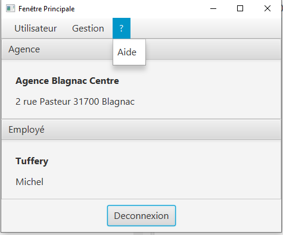
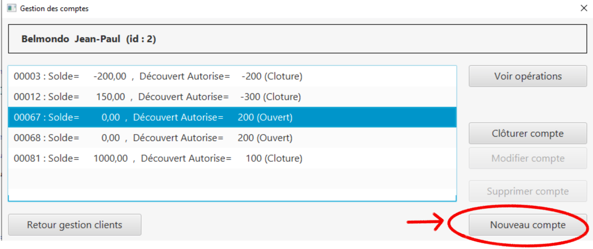

= Documentation utilisateur Version 2
:toc:
:toc-title: Sommaire

Créé par : Équipe 1B1

== I. Présentation de l'application
[.text-justify]
L'application DailyBank permet la gestion de vos comptes en banque. De votre maison, à votre travail, l'application rend vos comptes disponibles partout. Que vous soyez employés, client, guichetier ou chef d'agence, vous pouvez utiliser DailyBank.

== II. Installation utilisation, fonctionnement
=== Installation 

Notre application est codé sur eclipse en java *jdk17*. +
Pour installer l'application sur eclipse, il faut ouvrir un workspace pouvant gérer le javaFx, de plus il faut importer *DailyBank* pour acceder à l'application. Après avoir lancer le Maven Build avec " clean javafx:run", l'application se lancera toute seule et referez-vous à la doc Util en cas de problème. +
Au niveau de la base de données, pour se connecter nos identifiants sont : *G1B1S2* et notre mot de passe est : *password1234*. +
Pour changer de base de données, il suffit d'aller dans la class *LogToDatabase.java* et de changer les identifiants et mots de passes ici: 

image:Image Doc Tech/log.PNG[]

=== 1. Page d'accueil V0
Voici la page d'accueil. Pour commencer à utiliser DailyBank, appuyez sur "Connexion"

image:Image Doc Util/1.jpg[]

=== 2. Connexion V0
Une fois le bouton appuyé, voici le l'interface qui va apparaitre. Il suffit de rentrer vos informations tels que le Login et le mot de passe. Puis cliquez sur valider.

image:Image Doc Util/2.jpg[]

=== 3. Utilisateur V0
Bienvenue sur votre compte DailyBank!
Vous pouvez désormais cliquer sur la section "Utilisateur".

image:Image Doc Util/3.jpg[]

Ce bouton permet de se connecter ou de se deconnecter.

image:Image Doc Util/4.jpg[]

=== 4. Gestion V0
Vous pouvez également appuyer sur le bouton "Gestion".

Ce bouton permet de voir les comptes des employés ou des clients.

image:Image Doc Util/gestion.PNG[]

=== 5. Bouton "?" V0
Vous pouvez aussi selectionner le bouton "?".

image:Image Doc Util/6.jpg[]

Celui ci permet d'obtenir une aide.

=== 6. Gestion des comptes V0
Cliquons sur Gestion pour acceder aux comptes!

image:Image Doc Util/7.jpg[]

=== 7. Rechercher V0
Nous arrivons sur une autre page, celle ci est l'accueil de gestion de comptes. Cliquons sur rechercher.

image:Image Doc Util/8.jpg[]

=== 8. Comptes d'un utilisateur V0
Tous les utilisateurs apparaissent, choisissons un compte aléatoirement.

image:Image Doc Util/9.jpg[]

Cliquons sur "Comptes client"

=== 9. Prélévement automatique (GS)

Choisissons un client, et cliquons sur prel auto.

image:Image Doc Util/prel.PNG[]

Pour ajouter un prelevement auto, il suffit de cliquer sur nouveau prel auto

image:Image Doc Util/prel2.PNG[]

image:Image Doc Util/prel3.PNG[]

Puis pour supprimer il faut cliquer sur supprimer

=== 10. Opération (JB)

Voici les comptes de l'utilisateur que nous avons selectionné. Choisissons un compte aléatoirement, nous pouvons voir ses opérations en cliquant sur le bouton "opération".

image:Image Doc Util/12.jpg[]

=== 11. Débit / crédit (JB) / virement compte à compte (BR) / Débit Exceptionnel (JB)
Nous pouvons maintenant faire un crédit ou un débit, essayons avec un débit.

Maintenant Débit Exceptionnel, uniquement disponible pour le chef d'agence

Noyus voyons que le découvert autorisé du compte est de 400, or nous allons prelever plus que le découvert autorisé

image:Image Doc Util/debitex2.jpg[]

nous voyons que le solde est inférieur au découvert autorisé

image:Image Doc Util/debitex3.jpg[]

=== 12. Clôturer un compte (BR)
En cliquant sur le bouton "clôturer un compte", un pop-up apparaitra pour s'assurer de votre décision de clôturer le compte.

image:Image Doc Util/14.jpg[]

=== 13. Nouveau Compte utilisateur (GS)
Voici comment ouvrir un nouveau compte à un utilisateur.

image:Image Doc Util/16.jpg[]

=== 14. Modifier un client V0
Pour finir, vous avez la possibilité de modifier un client dans la partie gestion client.

image:Image Doc Util/17.jpg[]

