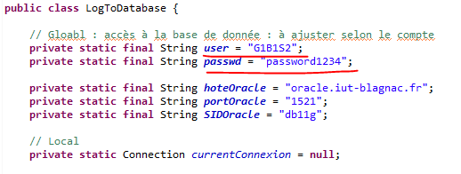
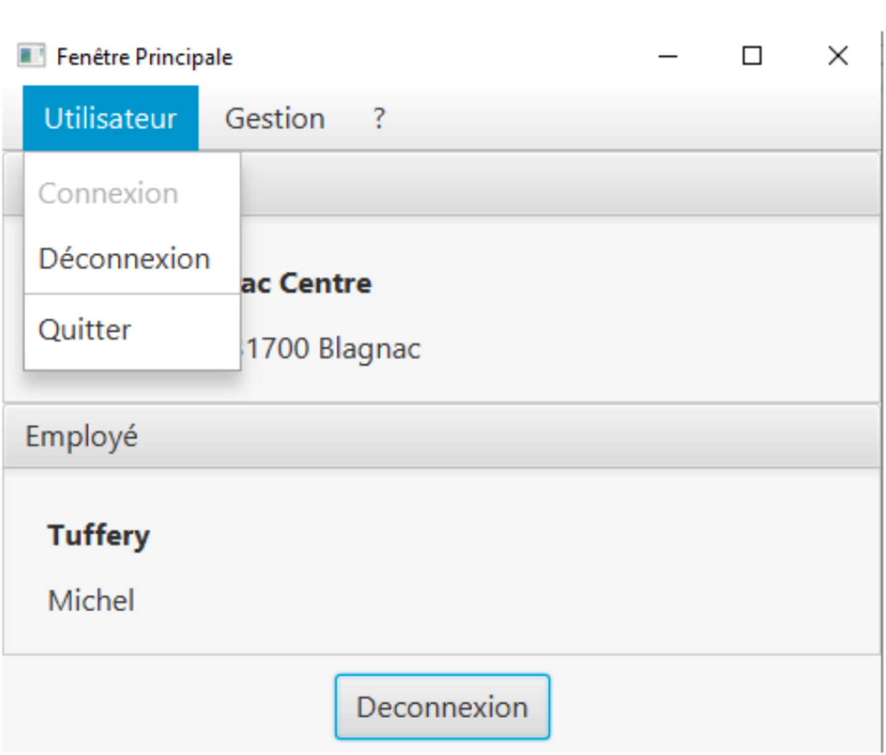
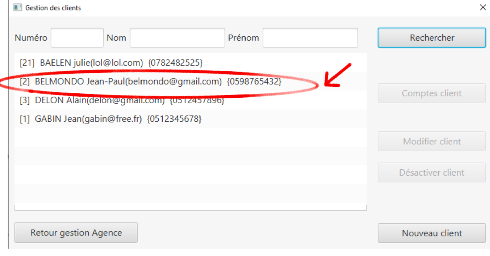
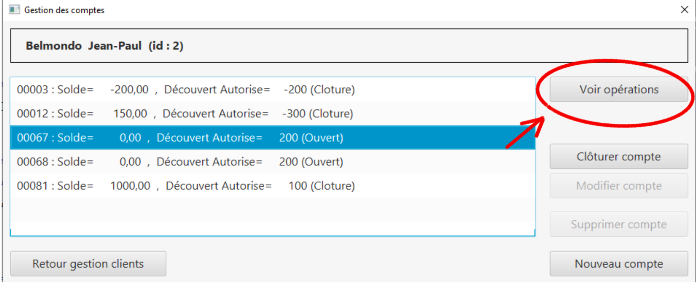
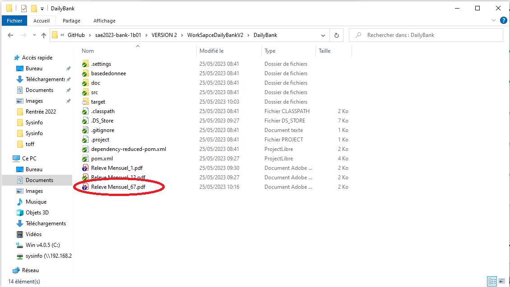
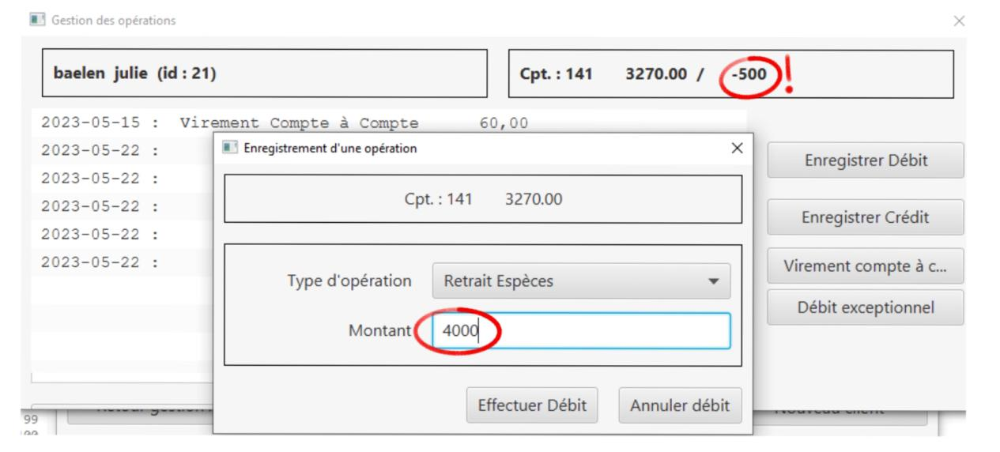

= Documentation utilisateur Version 2
:toc:
:toc-title: Sommaire

Créé par : Équipe 1B1

== I. Présentation de l'application
[.text-justify]
L'application DailyBank permet la gestion de vos comptes en banque. De votre maison, à votre travail, l'application rend vos comptes disponibles partout. Que vous soyez employés, client, guichetier ou chef d'agence, vous pouvez utiliser DailyBank.

Explication des différents rôles::
  * Le chef d'agence +
  ** Le chef d'agence est le rôle ayant le plus de droits dans notre application. Il est le seul à pouvoir gerer les débits excpetionnels, faire le CRUD des employés et generer des simulations d'emprunts avec ou sans assurance. Il peut également effectuer toute action que le guichetier peut faire. +
* Le guichetier +
 ** Le guichetier peut generer le pdf, faire le CRUD des prélévements automatiques, gérer les comptes d'un client et effectuer des actions dessus. +
* Le client +
 ** Le client peut acceder à son compte et effectuer des crédits/débits et virement. +
 * Le client inactif +
 ** Le client inactif ne peut plus acceder à ses comptes mais ses informations restent sur notre application.

== II. Installation
[.text-justify]
Notre application est codé sur eclipse en java *jdk17*. +
Pour installer l'application sur eclipse, il faut ouvrir un workspace pouvant gérer le javaFx, de plus il faut importer *DailyBank* pour acceder à l'application. Après avoir lancer le Maven Build avec " clean javafx:run", l'application se lancera toute seule et referez-vous à la doc Util en cas de problème. +
Au niveau de la base de données, pour se connecter nos identifiants sont : *G1B1S2* et notre mot de passe est : *password1234*. +
Pour changer de base de données, il suffit d'aller dans la class *LogToDatabase.java* et de changer les identifiants et mots de passes ici: 

== III. Fonctionnalité Guichetier

=== 1. Page d'accueil V0
Voici la page d'accueil. Pour commencer à utiliser DailyBank, appuyez sur "Connexion"

=== 2. Connexion V0
Une fois le bouton appuyé, voici le l'interface qui va apparaitre. Il suffit de rentrer vos informations tels que le Login et le mot de passe. Puis cliquez sur valider.
image:Image Doc Util/2.jpg[]

=== 3. Utilisateur V0
Bienvenue sur votre compte DailyBank!
Vous pouvez désormais cliquer sur la section "Utilisateur".

Ce bouton permet de se connecter ou de se deconnecter.

=== 4. Gestion V0
Vous pouvez également appuyer sur le bouton "Gestion".
image:Image Doc Util/5.jpg[]

Ce bouton permet de voir les comptes des employés ou des clients.
image:Image Doc Util/gestion.PNG[]

=== 5. Bouton "?" V0
Vous pouvez aussi selectionner le bouton "?".

Celui ci permet d'obtenir une aide.
image:Image Doc Util/aide.PNG[]

=== 6. Gestion des comptes V0
Cliquons sur Gestion pour acceder aux comptes!
image:Image Doc Util/7.jpg[]

=== 7. Rechercher V0
Nous arrivons sur une autre page, celle ci est l'accueil de gestion de comptes. Cliquons sur rechercher.
image:Image Doc Util/8.jpg[]

=== 8. Comptes d'un utilisateur V0
Tous les utilisateurs apparaissent, choisissons un compte aléatoirement.

Cliquons sur "Comptes client"
image:Image Doc Util/10.jpg[]

=== 9. Prélévement automatique (GS)

Choisissons un compte client, et cliquons sur prel auto.

Pour ajouter un prelevement auto, il suffit de cliquer sur nouveau prel auto

Pour rechercher un prélèvement spécifique, veuillez rentrer l'identifiant du prélèvement dans le champ "Numéro"

Ensuite, cliquez sur le bouton "Rechercher"

Et ainsi vous obtenez uniquement le prélèvement qui vous intéresse

Puis pour supprimer il faut cliquer sur supprimer
image:Image Doc Util/prelsup.PNG[]

=== 10. Opération (JB)

Voici les comptes de l'utilisateur que nous avons selectionné. Choisissons un compte aléatoirement, nous pouvons voir ses opérations en cliquant sur le bouton "opération".
image:Image Doc Util/11.jpg[]

=== 11. Débit / Crédit (JB) / Virement compte à compte (BR)

Nous pouvons maintenant faire un crédit ou un débit ou un virement de compte à compte, essayons avec un débit.

image:Image Doc Util/13.jpg[]

Maintenant virement de compte à compte. Dans la liste des opérations d'un compte *non clôturé*, cliquer sur "Virement de compte à compte".

Une fenêtre s'ouvre permettant de choisir un compte parmis les comptes *non clôturés* et de choisir le montant.
image:Image Doc Util/detailvirementcompte.png[]

Après avoir cliquer sur "Effectuer virement", le compte source sera débité du montant (en respectant les règles d'un débit sinon le virement ne s'effectue pas) et le compte destinataire sera créditer de ce montant.

=== 12. Générer un PDF de relevé de compte (BR)

Dans la gestion de compte, cliquez sur voir opération

Puis cliquez sur relevé de compte

Pour retrouver le fichier, il se trouve dans le répertoire courant de votre application (emplacement de `DailyBank` sur votre ordinateur)

=== 13. Clôturer un compte (BR)

En cliquant sur le bouton "clôturer un compte", un pop-up apparaitra pour s'assurer de votre décision de clôturer le compte.

image:Image Doc Util/cloturer.PNG[]

Lorsque que vous confirmer la clôturation, dans la liste des comptes, le compte concerné passera de "(Ouvert)" à "(Clôturer)"

=== 14. Nouveau Compte utilisateur (GS)

Voici comment ouvrir un nouveau compte à un utilisateur.
image:Image Doc Util/15.jpg[]
image:Image Doc Util/16.jpg[]

Le compte apparait donc sur l'ecran, et dans la base de données

=== 15. Modifier un client V0
Vous avez la possibilité de modifier un client dans la partie gestion client.

image:Image Doc Util/18.jpg[]

== IV. Fonctionnalité Chef d'agence

=== 1. Débit exceptionnel (JB)

Effectuer débit exceptionnel
image:Image Doc Util/debitex1.jpg[]

Noyus voyons que le découvert autorisé du compte est de 400, or nous allons prelever plus que le découvert autorisé

Nous voyons que le solde est inférieur au découvert autorisé

=== 2. Créer un emprunt (JB) / assurance emprunt (BR)

Dans la fenêtre de gestion des clients, sélectionner un client et cliquer sur "Emprunts client"

Un fenêtre avec la liste des différents emprunts du client s'affiche. Cliquer sur "Nouvel Emprunt"

Un fenêtre de saisi s'ouvre avec la possibilité d'ajouter une assurance au nouvel emprunt. Cliquer sur "Valider" pour que l'emprunt (et son assurance si voulu) soit ajouter ou cliquer sur "Annuler" pour que l'action n'est pas lieu

Si la saisie de l'emprunt n'est pas valide lorsqu'on clique sur "Valider" une fenêtre s'afficher avec l'erreur correspondant. Sinon l'emprunt est ajouté à la liste des emprunt du client.

=== 2. Simuler l'emprunt et son assurance (BR)

Dans la liste des emprunts d'un client, sélectionner un emprunt puis cliquer sur "Détails Emprunt"

Une nouvel fenêtre s'ouvre. Cliquer sur "Actualiser Emprunt" pour que la simulation de l'emprunt s'exécute. Le résultat s'affiche dans la liste.

Si l'emprunt possède une assurance alors le bouton "Actualiser Assurance" s'affiche, cliquer dessus. la simulation de l'assurance s'affiche à côté de la liste.

